# Настройка Google Cloud Project для YouTube API

Для работы загрузки, удаления и fallback-чтения через YouTube Data API v3 необходимо настроить проект в Google Cloud и
получить OAuth-credentials.

## 1. Создание проекта

1. Перейдите в [Google Cloud Console](https://console.cloud.google.com/).
2. Создайте новый проект (или выберите существующий).

## 2. Включение YouTube Data API v3

3. В разделе **APIs & Services** перейдите в **Library**:
   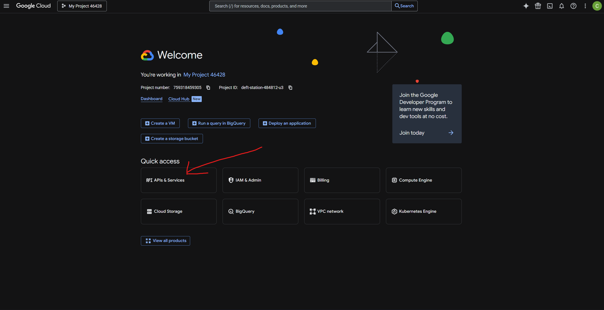
   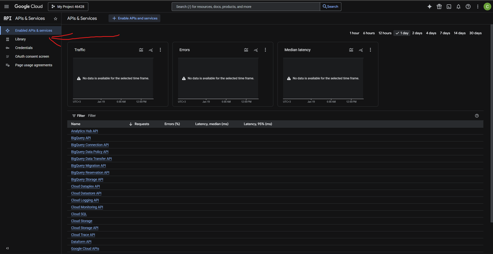
4. Найдите и включите **YouTube Data API v3**:
   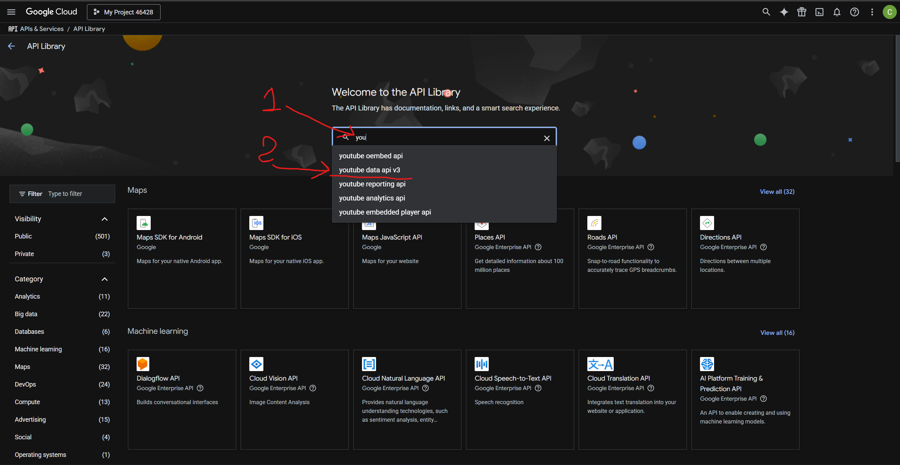
   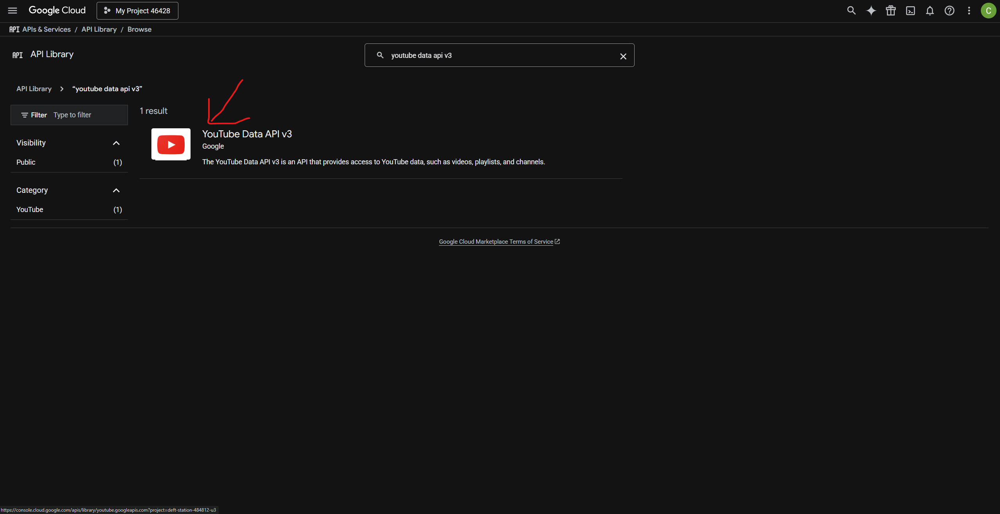
   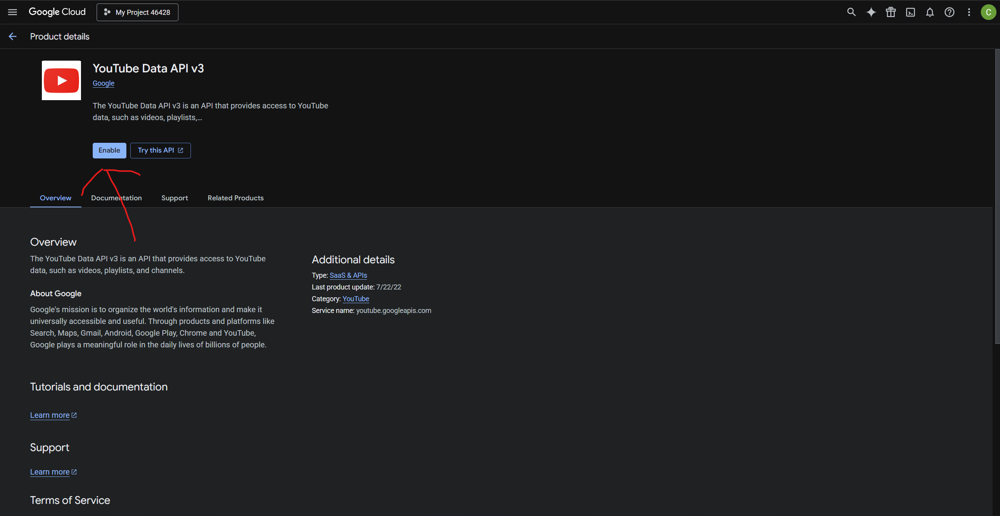

## 3. Настройка OAuth consent screen

5. Перейдите в раздел **Credentials** и нажмите **Configure consent screen**:
   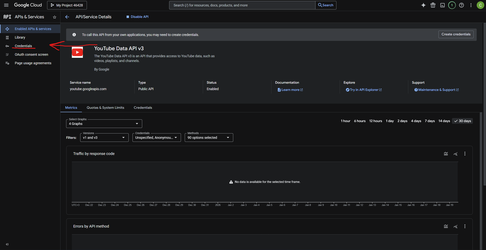
   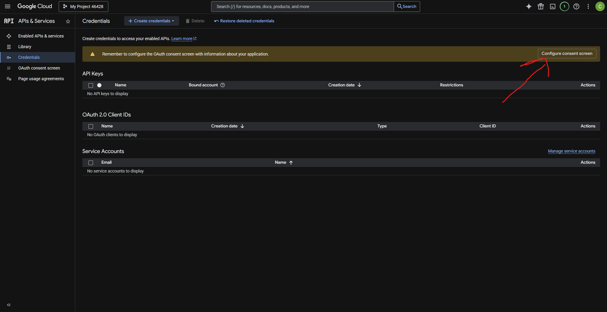
6. Нажмите **Get Started** и настройте окно согласия (OAuth consent screen):
    - Укажите **App name** — должно совпадать с настройкой `app_name` в MediaOrcestrator.
    - Выберите **User support email**.
      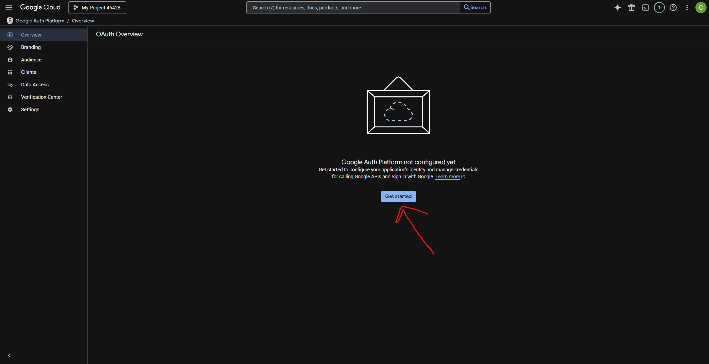
      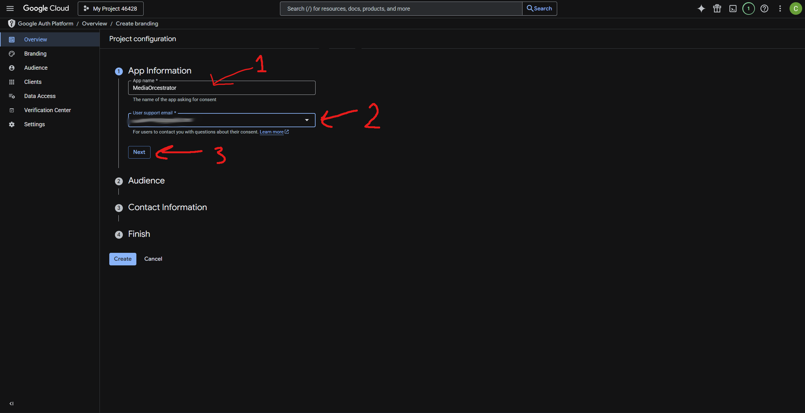
7. В разделе **Audience** выберите **External** и нажмите **Next**:
   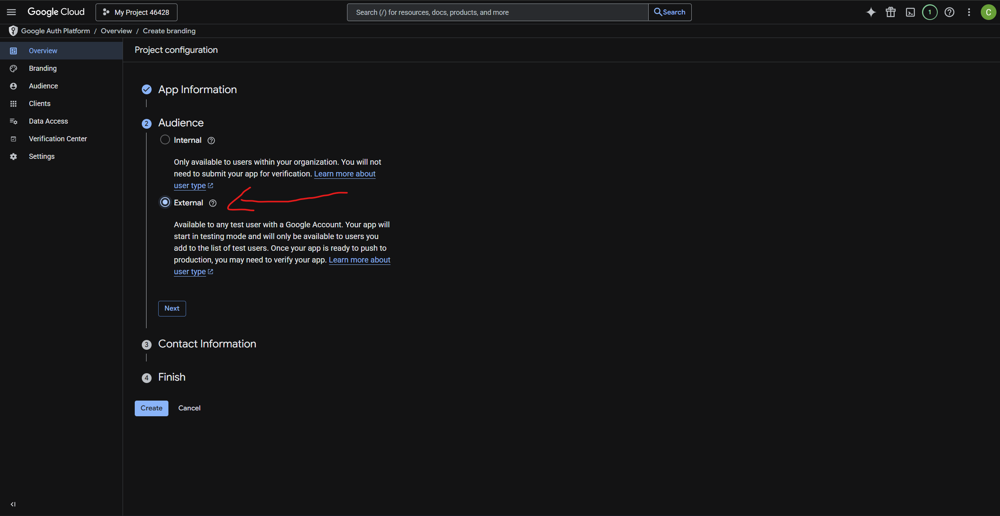
   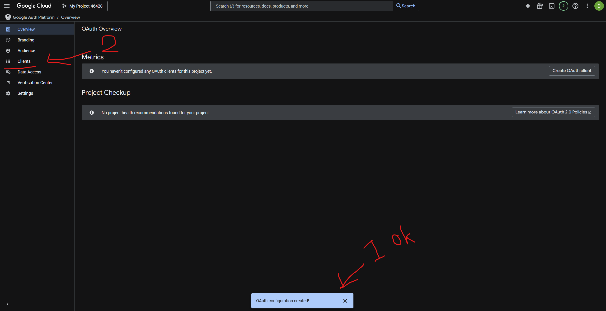

## 4. Создание OAuth Client

8. Перейдите в раздел **Clients**, нажмите **+ Create client**:
   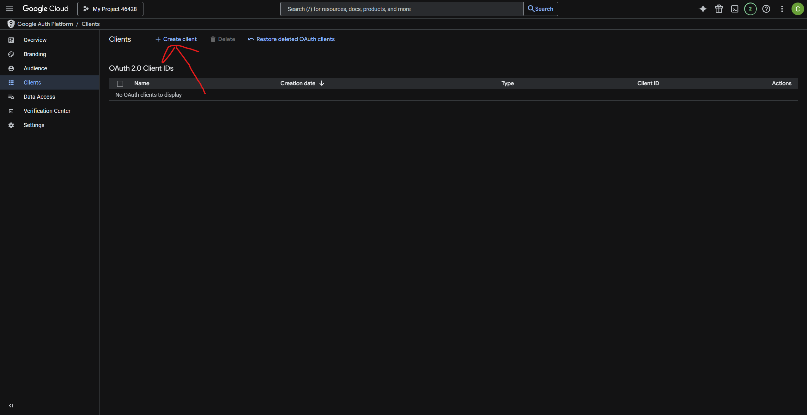
9. Выберите тип приложения **Desktop App**, введите название и нажмите **Create**:
   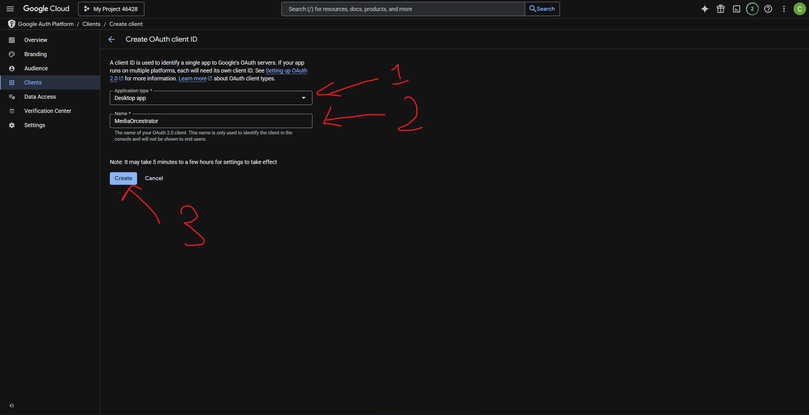
10. Скопируйте **Client ID** и **Client Secret**:
    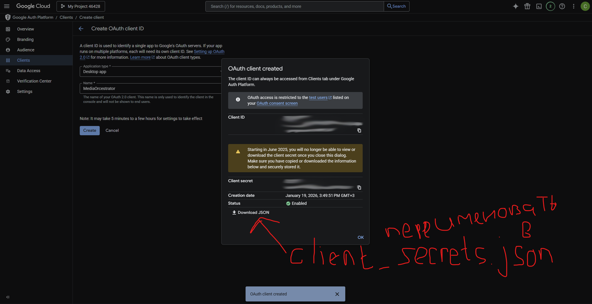

## 5. Добавление тестовых пользователей

11. **ОБЯЗАТЕЛЬНО**: Добавьте свой email в список **Test users**.
    Без этого при попытке входа вы получите ошибку `403: access_denied`, так как приложение находится в статусе "
    Testing".
    - Перейдите в раздел **Audience**.
    - Прокрутите вниз до раздела **Test users**.
    - Нажмите **+ ADD USERS** и введите свой Gmail.
      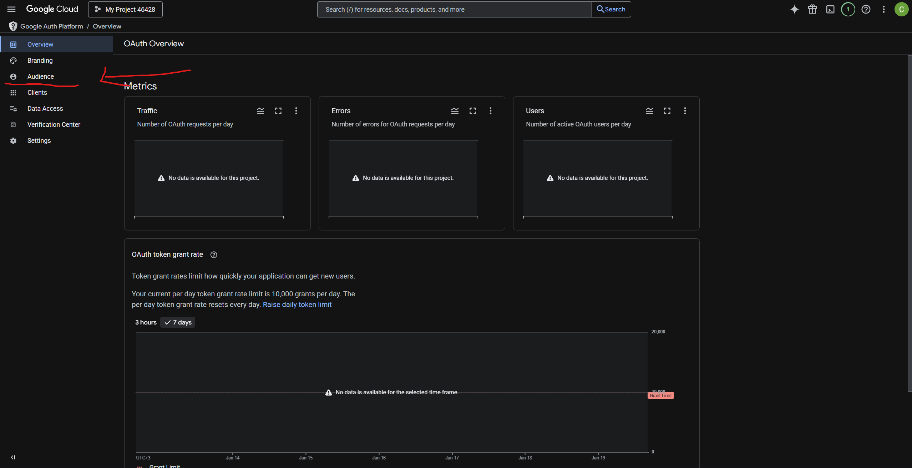
      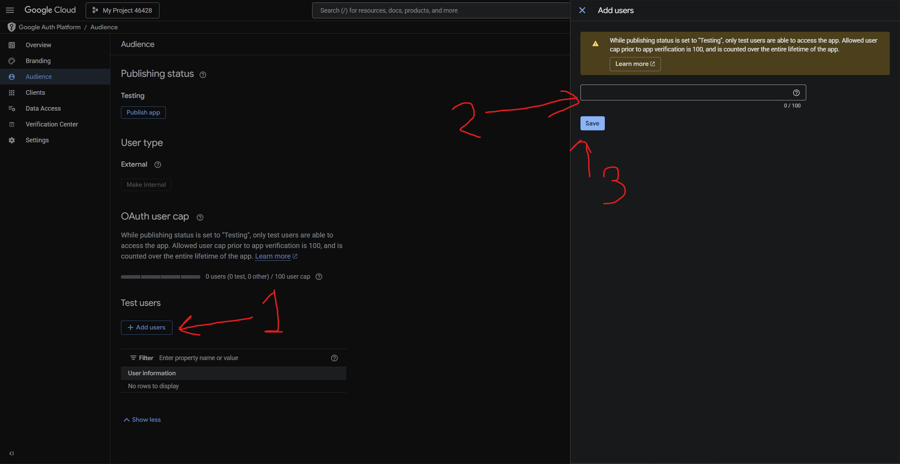

## 6. Настройка в MediaOrcestrator

В настройках YouTube-источника укажите:

| Настройка       | Значение                                      |
|-----------------|-----------------------------------------------|
| `app_name`      | Название проекта из шага 6 (должно совпадать) |
| `client_id`     | Client ID из шага 10                          |
| `client_secret` | Client Secret из шага 10                      |

При первом обращении к API откроется браузер для авторизации через Google-аккаунт. OAuth-токен сохранится в общую папку
состояний источника (`state/{source_id}/oauth/`) и будет автоматически обновляться. Ранее путь задавался настройкой
`token_path` — при первом запуске существующие токены автоматически мигрируются.

## Квота

Дефолтная квота YouTube Data API v3 — **10 000 units/день**:

| Операция                                   | Стоимость                   |
|--------------------------------------------|-----------------------------|
| Загрузка видео (`videos.insert`)           | 1 600 units (~6 видео/день) |
| Удаление видео (`videos.delete`)           | 50 units                    |
| Обновление метаданных (`videos.update`)    | 50 units                    |
| Список видео канала (`playlistItems.list`) | 1 unit/страница (50 видео)  |
| Информация о видео (`videos.list`)         | 1 unit/запрос               |
| Категории (`videoCategories.list`)         | 1 unit                      |

Для увеличения квоты нужно подать заявку
через [YouTube API compliance audit](https://support.google.com/youtube/contact/yt_api_form).
